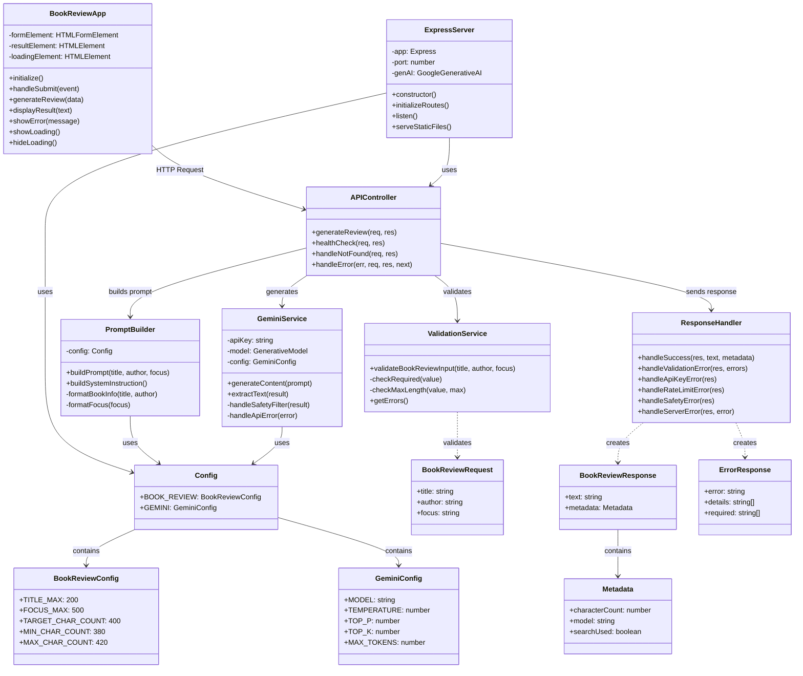
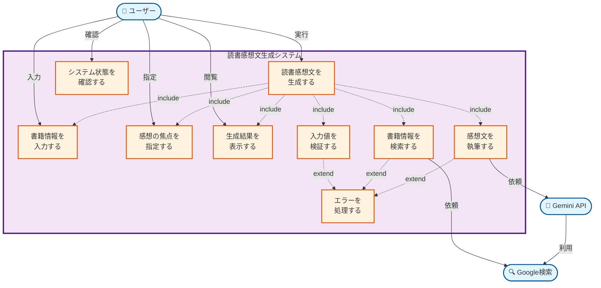
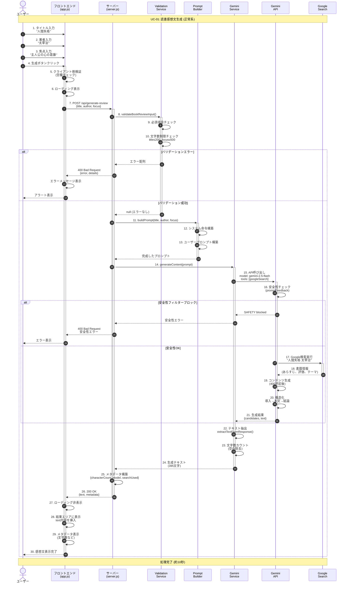
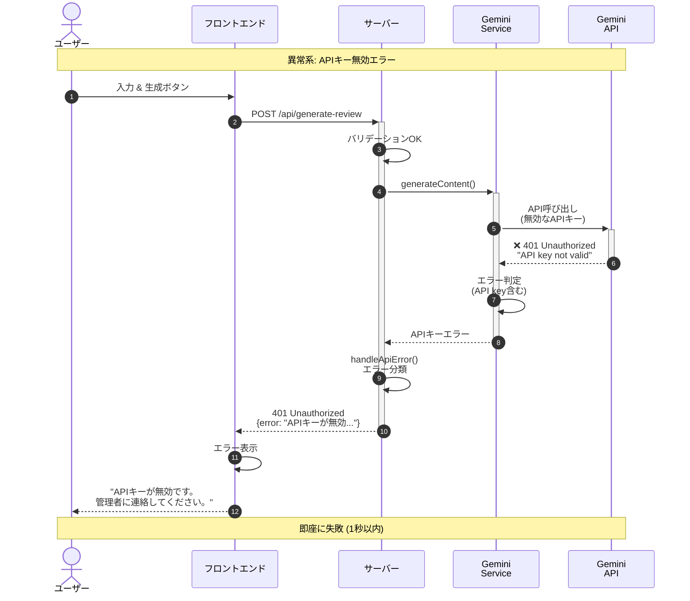
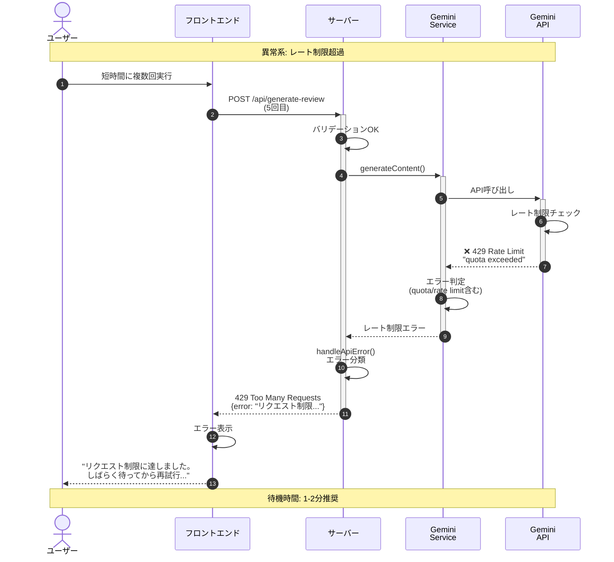
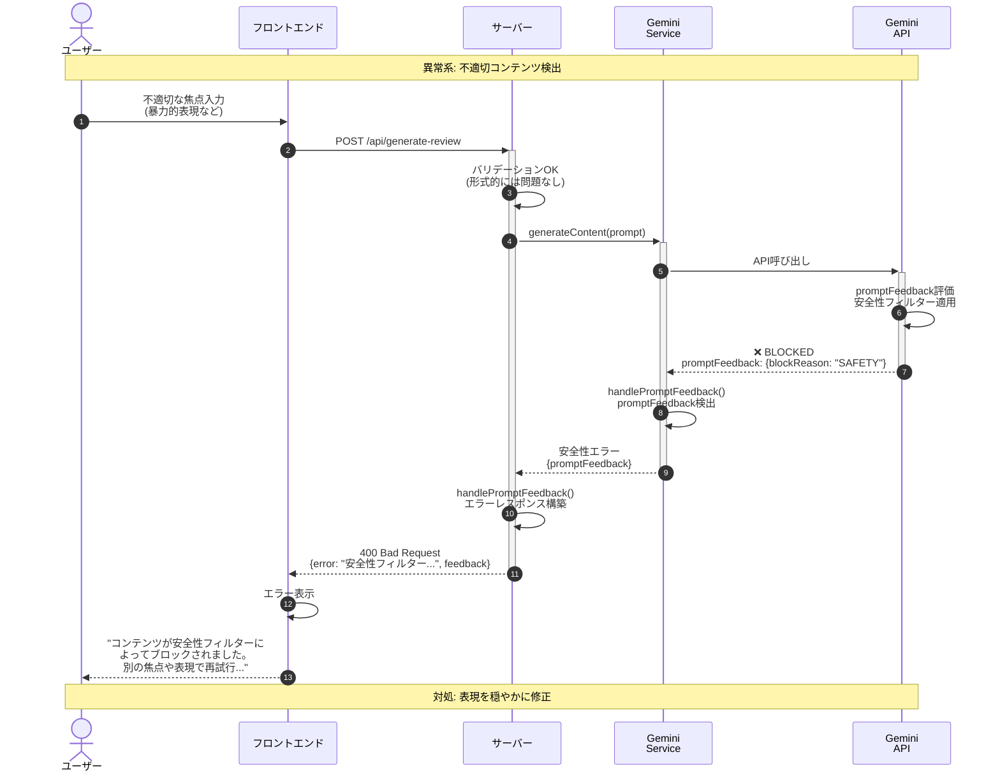
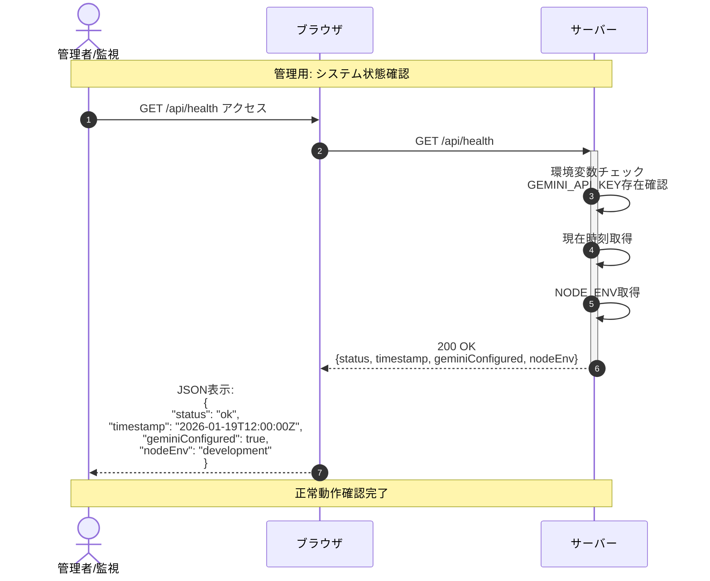

# 読書感想文生成アプリ - Mermaid設計図

## 1. クラス図 (Class Diagram)

システムの主要クラスとその関係性を示します。

---

## 2. ユースケース図 (Use Case Diagram)

システムの機能とアクターの関係を示します。

**ユースケース詳細:**

| ID | ユースケース名 | 説明 | 主アクター |
|----|--------------|------|-----------|
| UC1 | 読書感想文を生成する | メイン機能：書籍の感想文を生成 | ユーザー |
| UC2 | 書籍情報を入力する | タイトル・著者を入力 | ユーザー |
| UC3 | 感想の焦点を指定する | 感想文の視点・テーマを指定 | ユーザー |
| UC4 | 生成結果を表示する | 完成した感想文を画面表示 | ユーザー |
| UC5 | エラーを処理する | エラーメッセージを表示 | システム |
| UC6 | 書籍情報を検索する | Google検索で書籍データ取得 | Gemini API |
| UC7 | 感想文を執筆する | AIによる感想文生成 | Gemini API |
| UC8 | 入力値を検証する | バリデーション実行 | システム |
| UC9 | システム状態を確認する | ヘルスチェック実行 | ユーザー |

---

## 3. シーケンス図 (Sequence Diagram)

### 3-1. 正常系シナリオ：感想文生成成功

---

### 3-2. 異常系シナリオ：APIキーエラー

---

### 3-3. 異常系シナリオ：レート制限エラー

---

### 3-4. 異常系シナリオ：安全性フィルターブロック

---

### 3-5. 管理シナリオ：ヘルスチェック

---

## 図の活用方法

### クラス図の活用
- **開発者向け**: コード構造の理解と実装の参考
- **保守担当**: 依存関係の把握と影響範囲の特定
- **新規メンバー**: システム全体像の把握

### ユースケース図の活用
- **企画・PM**: 機能要件の整理
- **テスター**: テストケース設計の基盤
- **ユーザー**: システムでできることの理解

### シーケンス図の活用
- **開発者**: 処理フローの実装確認
- **デバッグ**: エラー発生箇所の特定
- **ドキュメント**: 動作仕様の説明

---

**作成日:** 2026年1月19日  
**図表形式:** Mermaid (Markdown埋め込み可能)